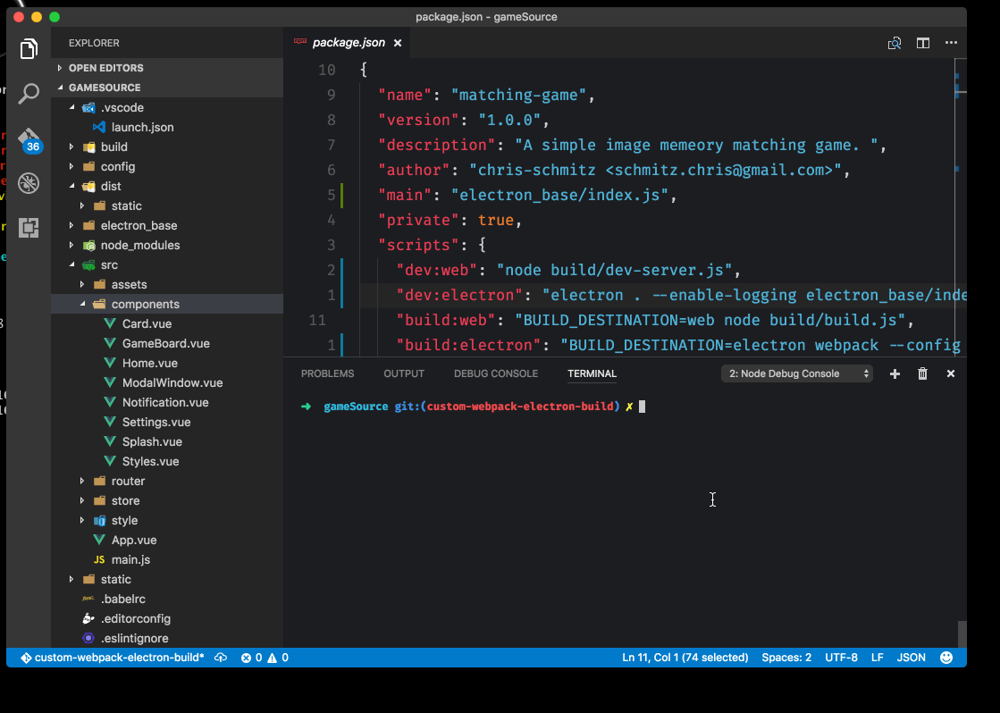
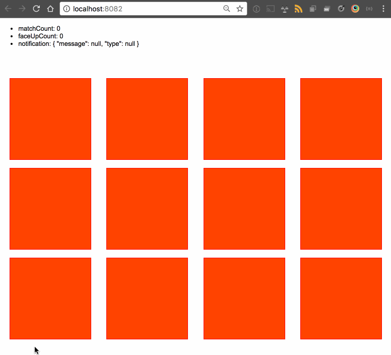
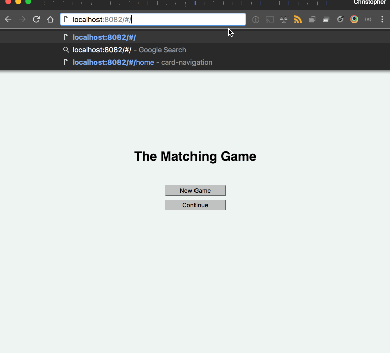

# Matching Game

> A simple image memeory matching game.



# The TL;DR
- [Get up and running](#get-up-and-running)
- [Building production versions](#building-production-versions) _(not finished yet)_

# The DR
- [The log form backstory](#what-this-is)


# What this is
This project is a matching game I built for my daughter ... aaaand a platform for me to explore a couple of new tools, concepts, and project structures ;).

The goal of this project was to build a matching game with a component codebase that will work both on the web and on the desktop.

The UI is built using [vue.js](https://www.vuejs.org), the state is maintained through the [vuex](https://github.com/vuejs/vuex), and the game is delivered via the web and to the desktop via [electron](https://electron.atom.io/).

Vue has been my js ui/ux toolset of choice for a while now, but up until this project I've not used vuex for state management; I tended to create my own custom store for managing state. A large part of building out this project was creating a real world scenario for me to buckle down in and grok vuex. I've built one electron app before, [AppLauncher](https://github.com/chris-schmitz/app-launcher) and loved electron so this is my second big dive into it.

# Design, planning, and prototypes

## Wireframes
Whenever I start a new project I tend to wireframe it to get my ideas out.


_please excuse the overlaps, this png is showing all layers of the diagram._

The wireframe can be found [in the diagrams folder](diagrams/), can be opened in [draw.io](http://www.draw.io), and and here is a more [interactive preview](https://www.draw.io/?lightbox=1&highlight=0000ff&edit=_blank&layers=1&nav=1&title=Matching%20Game.xml#Uhttps%3A%2F%2Fraw.githubusercontent.com%2Fchris-schmitz%2Fmatching-game%2Fmaster%2Fdiagrams%2FMatching%2520Game.xml).

## Prototypes

Before building out the app itself I wanted to focus in on two of its important aspects so I could think those out without having to worry about how they fit into the app as a whole, so I built them out as prototypes.

- [Card Flip](prototypes/card-flip)

- [Panel Navigation](prototypes/card-navigation)
    - _The folder for this one is actually called card navigation (a naming holdover from my time as a sencha dev :P) but it's a prototype for navigation between the main views and shouldn't be confused with the playing cards_.


Each of these prototypes are projects on their own, i.e. they have their own `package.json`s and dev scripts.

Once I had these hammered out I was comfortable with starting the actual project build.

# The project structure

As stated earlier, one of the goals is to have a game UI codebase that can run both on the web and on the desktop. I'm ok with adjusting per environment a little as needed, but my hope is to reuse as much code as I can.

This dictates the project structure. The starting point for the actual game code base is in the [game_source](game_source) directory. The source code (the UI) used for both web and electron is in the [src](game_source/src) folder. The particular webpack config used is what determines if you're building for the web or electron.

If you review the webpack files found in [the game_source build folder](game_source/build) you'll find the three webpack configs that branch off the webpack dev or building logic.

The files [webpack.dev.conf.js](game_source/build/webpack.dev.conf.js), [webpack.prod.conf.js](game_source/build/webpack.prod.conf.js) files determine the build configuration specific to web development. These files along with most of the other build and configuration files were genrated by [vue-cli](https://github.com/vuejs/vue-cli)'s webpack template.

The file [webpack.electron.conf.js](game_source/build/webpack.electron.conf.js) is a config file I added in to build specifically for electron.

From there, the specific npm script run will point to either the web dev or build scripts vs the electron dev or build scripts.

```json
"scripts": {
    "dev:web": "node build/dev-server.js",
    "build:web": "BUILD_DESTINATION=web node build/build.js",

    "dev:electron": "electron . --enable-logging electron_base/index.js",
    "build:electron": "BUILD_DESTINATION=electron webpack --config build/webpack.electron.conf.js",
}
```
_The dev and build scripts have just recently been hammered out so they are definitely going to change soon. Hopefully once they have been changed I remember to come back and remove this comment. ;)_

# Get up and running
Here's how you can pull down this project and get it running.

From the terminal in a directory that you'd like to save the project to:
``` bash
# Clone the project
git clone https://github.com/chris-schmitz/matching-game.git

# go into the game source folder
cd matching-game/game_source

# install dependencies
npm install

# serve web version with hot reload at localhost:8080
npm run dev:web

# launch a temp development electron version
npm run dev:electron
```

# Building production versions
The project is still being built so I haven't finished setting up the build part yet ;)

## Dependencies
If you're on a mac and you're triyng to package the electron app for windows there are a couple of dependencies you need that cannot be installed via npm.
- [Quartz](https://www.xquartz.org/)
    - note this will require an os logout/log back in.
- [Wine](https://www.winehq.org/)
    - you can install this directly, or you can install it via homebrew (which I'd suggest)
    - [Homebrew](https://brew.sh/) // If you're a developer using a mac and you don't have homebrew you should install this anyway. Think NPM for your OS.

I plan to create a more sophisticated build process in the future (in the style of the [electron-vue](https://github.com/SimulatedGREG/electron-vue) project. I wanted to use this scaffold but couldn't figure out how to fit it in well with the webpack vue-cli scaffold I started the project with), but for now I'm getting by with a very basic build script.

At the moment, this basic build script will build for mac, linux, and windows. If you want to alter this, review the `package` npm script in the [`game_source/package.json`](game_source/package.json) file. In the more sophisticated version (likely the beta version) you'll be able to build for all or each of the platforms, but for now you'll have to manually change the script to fit your needs.

Building and packaging the app from the terminal:

```bash
cd game_source
npm run buildAndPack
# This will create the packaged builds in the `_packaged_builds` folder at the root of the project.
```